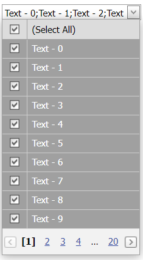

<!-- default badges list -->

[](https://supportcenter.devexpress.com/ticket/details/E3467)
[](https://docs.devexpress.com/GeneralInformation/403183)
<!-- default badges end -->
# Grid Lookup for ASP.NET Web Forms - How to enable multiple selection
<!-- run online -->
**[[Run Online]](https://codecentral.devexpress.com/e3467/)**
<!-- run online end -->

This example demonstrates how to create a command column and enable multiple selection mode.



## Overview

Follow the steps below to enable multiple selection in a grid control:

1. Enable a command column's [ShowSelectCheckbox](https://docs.devexpress.com/AspNet/DevExpress.Web.GridViewCommandColumn.ShowSelectCheckbox) property and set the [SelectAllCheckboxMode](https://docs.devexpress.com/AspNet/DevExpress.Web.GridViewCommandColumn.SelectAllCheckboxMode) property to `AllPages` to select and deselect all records on all grid pages.

2. Set the grid's [SelectionMode](https://docs.devexpress.com/AspNet/DevExpress.Web.ASPxGridLookup.SelectionMode) property to `Miltiple`.

```aspx
<dx:ASPxGridLookup ID="gridLookup" runat="server" SelectionMode="Multiple" ...>
    <Columns>
        <dx:GridViewCommandColumn ShowSelectCheckbox="True" SelectAllCheckboxMode="AllPages" />
        <!-- ... -->
    </Columns>
    <!-- ... -->
</dx:ASPxGridLookup>
```

## Files to Review

* [Default.aspx](./CS/WebSite/Default.aspx) (VB: [Default.aspx](./VB/WebSite/Default.aspx))
* [Default.aspx.cs](./CS/WebSite/Default.aspx.cs) (VB: [Default.aspx.vb](./VB/WebSite/Default.aspx.vb))

## Documentation

* [Grid Selection](https://docs.devexpress.com/AspNet/3737/components/grid-view/concepts/focus-and-navigation/selection)
* [Selection Modes](https://docs.devexpress.com/AspNet/9075/components/grid-view/concepts/aspxgridlookup/selection-modes)
